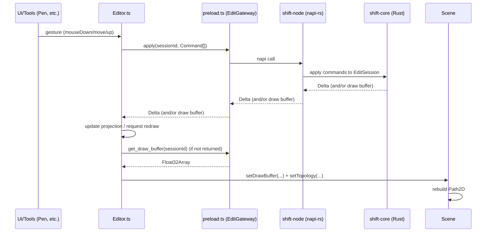
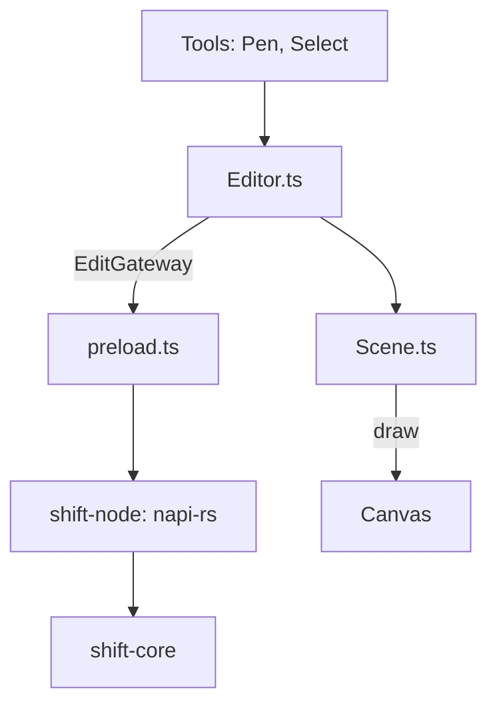

## Editor–Font Engine Integration Plan

### Goals
- Rust owns all glyph/contour/point state; the renderer never mutates model state directly.
- The editor sends commands to a session; Rust returns snapshots or deltas for redraw.
- Keep the renderer fast via a draw-buffer (display list) while retaining simple interactions.

### Architecture (high-level)




### Contracts (keep tiny, versioned)

- IDs: `SessionId`, `GlyphId`, `ContourId`, `PointId` (opaque strings in TS; 64-bit/UUID in Rust). All coordinates in UPM.
- Versioning: every read/response includes `outlineVersion` (monotonic per session).

Minimal TypeScript DTOs (generated via ts-rs):
```ts
export type PointType = "onCurve" | "offCurve";

export type Command =
  | { type: "AddContour" }
  | { type: "CloseContour"; contourId: string }
  | { type: "AddPoint"; contourId: string; x: number; y: number; pointType: PointType; smooth: boolean; after?: string }
  | { type: "MovePoint"; pointId: string; to: { x: number; y: number } }
  | { type: "RemovePoint"; pointId: string }
  | { type: "SetPointType"; pointId: string; pointType: PointType; smooth: boolean }
  | { type: "UpgradeSegment"; anchorId: string; to: "quad" | "cubic" };

export interface Delta {
  outlineVersion: number;
  addedPoints?: Array<{ pointId: string; contourId: string; x: number; y: number; type: PointType; smooth: boolean; order: number }>;
  movedPoints?: Array<{ pointId: string; to: { x: number; y: number } }>;
  removedPoints?: string[];
  updatedContours?: Array<{ contourId: string; closed: boolean }>;
  createdContours?: Array<{ contourId: string }>;
  removedContours?: string[];
}

export interface Outline {
  outlineVersion: number;
  contours: Array<{
    contourId: string;
    closed: boolean;
    points: Array<{ pointId: string; x: number; y: number; type: PointType; smooth: boolean; order: number }>;
  }>;
}
```

Rust sketch (napi-rs + ts-rs):
```rust
#[derive(serde::Serialize, serde::Deserialize, ts_rs::TS)]
#[ts(export)]
#[serde(tag = "type", rename_all = "camelCase")]
pub enum Command {
  AddContour,
  CloseContour { contour_id: ContourId },
  AddPoint { contour_id: ContourId, x: f64, y: f64, point_type: PointType, smooth: bool, after: Option<PointId> },
  MovePoint { point_id: PointId, to: Point },
  RemovePoint { point_id: PointId },
  SetPointType { point_id: PointId, point_type: PointType, smooth: bool },
  UpgradeSegment { anchor_id: PointId, to: SegmentKind },
}
```

Draw buffer ABI (display list) for fast rendering:
```ts
// Float32Array: [OP, ...args, OP, ...args, ...]
// Version 1
const OP = { MOVE: 1, LINE: 2, QUAD: 3, CUBIC: 4, CLOSE: 5 } as const;
// MOVE:  OP.MOVE, x, y
// LINE:  OP.LINE, x, y
// QUAD:  OP.QUAD, cx, cy, x, y
// CUBIC: OP.CUBIC, cx1, cy1, cx2, cy2, x, y
// CLOSE: OP.CLOSE
```

### Session lifecycle
- `start_edit_session(glyphId) -> sessionId`
- `apply(sessionId, Command[]) -> Delta` (atomic batch)
- `get_outline(sessionId) -> Outline` and/or `get_draw_buffer(sessionId) -> ArrayBuffer`
- `end_edit_session(sessionId)`

Multiple glyphs: prefer one session per open glyph. When switching, end the old session, start a new one. IDs and versions are per-session.

### Frontend responsibilities
- Editor: translate gestures to `Command[]`, preview locally, commit on mouseup, then refresh Scene (buffer + topology/outline) and redraw. Keep selection and undo locally (phase 1).
- Scene: projection only. APIs: `setDrawBuffer(Float32Array)`, `loadOutline/Topology(...)`. Build `Path2D`, paint handles, guides.
- Tools (Pen): no model mutations—only preview + commit via session.

### Backend responsibilities
- Core/Engine: authoritative model; stable IDs; transactional `apply` producing `Delta`; `get_draw_buffer` and `get_outline`.
- Node binding (napi-rs): expose a narrow `EditGateway` surface.
- Preload: adapt engine to renderer (`openSession`, `apply`, `getDrawBuffer`, `getOutline`, `endSession`).

### Migration plan (phased)
1) Skeleton
- Add Rust `EditSession`: `start`, `apply`, `get_outline`, `get_draw_buffer`, `end`.
- Preload exposes `EditGateway` (no full engine exposure).
- Renderer uses `EditSession` for one simple action (AddPoint), then pulls outline + buffer to draw.

2) Tool conversion
- Convert Pen: mouseDown -> AddPoint; drag preview local; mouseUp -> batch (UpgradeSegment, MovePoint).
- Replace Editor direct mutations with command commits + refresh.
- Scene draws from buffer; handles/topology from outline.

3) Cleanup
- Remove `ContourManager.ts` and TS-side model mutations.
- Keep selection/undo in UI (inverse command batches).

4) Optimization
- Make `apply` return `Delta`; add `Scene.applyDelta(delta)`.
- Zero-copy buffers; optional push updates later.

### Ticketable action plan (GitHub-style checklist)
- [ ] Core: Implement `EditSession` (start/apply/get_outline/get_draw_buffer/end)
- [ ] Core: Define `Command`, `Delta`, `Outline` (serde + ts-rs) and generate types
- [ ] Node: Expose napi methods for session + commands + queries
- [ ] Preload: Implement `EditGateway` surface (hide full engine)
- [ ] Renderer: Create `EditSession` client wrapper in `lib/core/FontEngine.ts`
- [ ] Renderer: Add `Scene.setDrawBuffer` and `Scene.loadOutline`
- [ ] Renderer: Convert Pen to send commands (preview local, commit batch)
- [ ] Renderer: Replace all direct mutations in `Editor.ts` with command commits
- [ ] Renderer: Delete `ContourManager.ts` and remove TS-side model ownership
- [ ] Add basic tests: command → outline/draw buffer; buffer decoding
- [ ] Optional: `apply` returns `Delta`; implement `Scene.applyDelta`

### Risks & mitigations
- Too many redraws: batch commands; throttle outline fetch; move to deltas.
- ID drift: all IDs originate in engine; return new IDs in `Delta`.
- Interaction complexity without outline: keep a small topology snapshot until engine hit-testing exists.

---
Short summary: The editor sends batched commands to a Rust-owned session and renders from an engine-supplied draw buffer, using a small outline/topology snapshot for interactions. Start with snapshot refreshes for simplicity; add deltas and optimizations once the walking skeleton is stable.
